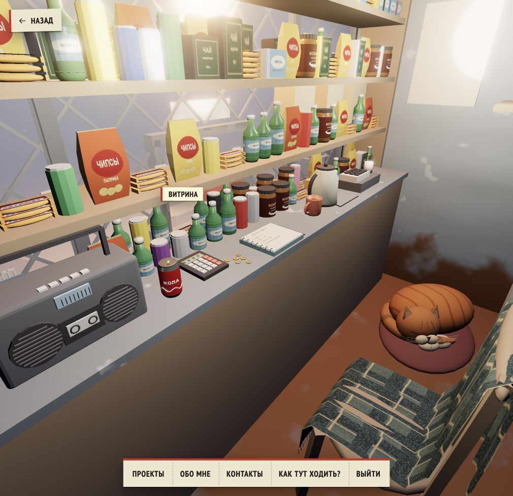
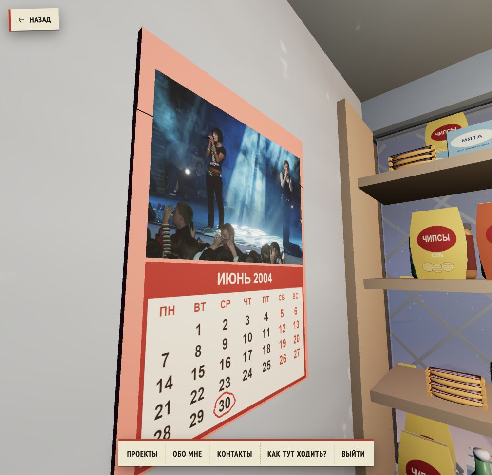

# Counter, June calendar and smoother travel — 2026-10-06

User corrections to 70c0393:
- Move and shorten the notebook to the free seller side, at least 4 cm clear of retail geometry. Put the pen alongside the notebook, on the counter.
- Replace the sloping calculator wedge with a 14 mm flat body, 4 mm keys and display away from the seller. Export bounds confirm total height <=21 mm and correct display/keypad orientation.
- Red calendar with June 2004, correct weekday grid, day 30 circled with an irregular red marker line. Upper picture is a real t.A.T.u. concert photo with blue stage lighting. The horse request was superseded and its project assets removed.
- Photo: Dmitry Azarov, Kirov, 31 October 2006, [source](https://commons.wikimedia.org/wiki/File:Tatu_in_Kirov_October_31_2006.jpg), [CC BY-SA 3.0](https://creativecommons.org/licenses/by-sa/3.0/). Resized/recompressed only. Photo/derivative retains this license. Month text is the requested June 2004, not the photo date.
- Camera trips use sine acceleration, about 15–20% shorter distance-based durations, and independent orientation interpolation. Straight paths use quaternion turns; walking paths precompute and unwrap yaw so a moving heading never reverses its interpolation at 180 degrees. Existing walking waypoints and reduced-motion instant navigation remain.

Verification:
- `npm test`: 120 JavaScript + 9 Python tests passed.
- Notebook clearance and flat calculator tests failed against old GLB, passed after rebuild. New rack-to-inside yaw regression reproduced a 54-degree flip in the first interpolation approach; the continuous yaw correction passes 3000-step sampling.
- Independent review confirmed 42 actual GLB preset walking routes at 3000 steps each, including render-loop lookAt, without jumps or endpoint mismatch. Restored a separate discHeading vector for the carried-disc animation.
- `npm run validate:content` and `npm run build` pass. Existing Vite bundle-size advisory remains.
- Blender GLB export passes. Scene grows by approximately 90 KB for the calendar textures.
- Targeted browser script `scripts/kiosk/check-corrections-browser.js`: rack → inside, return to previous rack view, about billboard, DVD carried to TV then removed, mobile reduced motion all pass; no page errors.
- Native preview: notebook clear, calculator flat/turned, calendar photo/date/marker visibly verified; console warning/error list empty.

