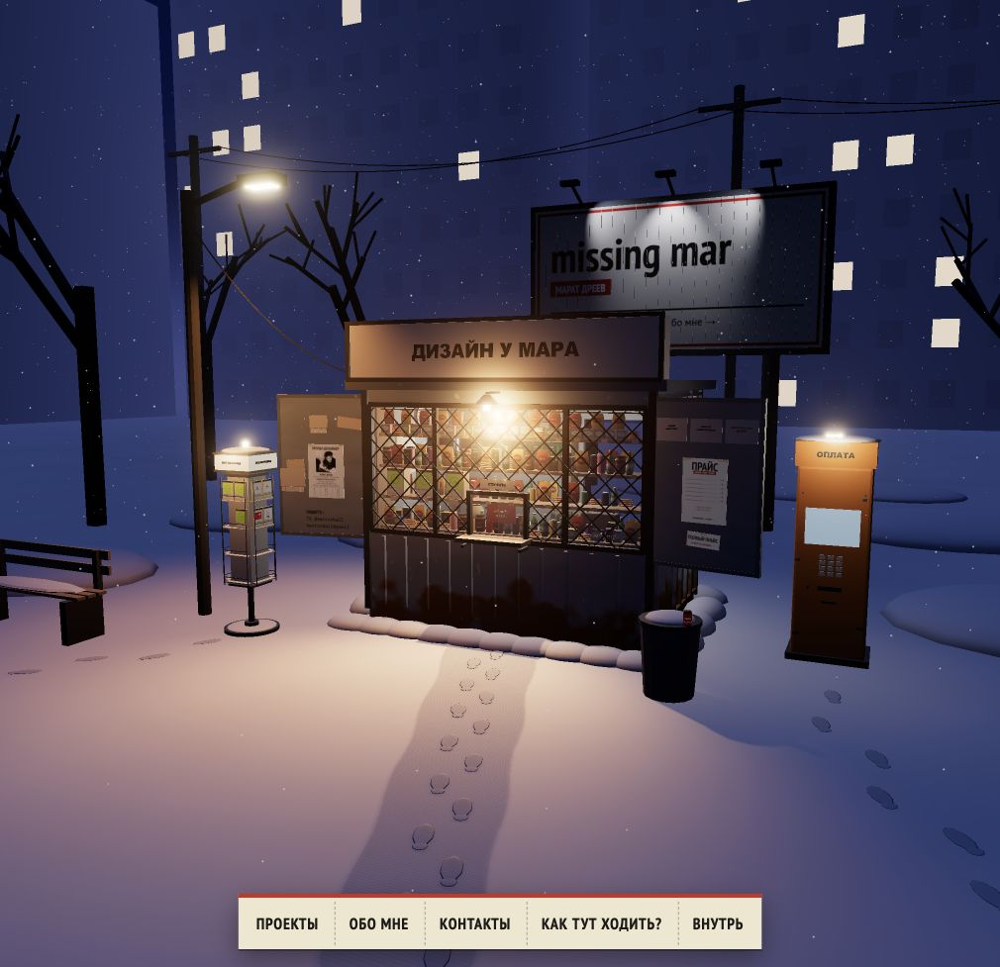

# Footprints toward the kiosk — 2026-10-06

- Main trail now travels from the street toward the showcase; heel lies behind the broad forefoot and each print follows the path's tangent.
- Two sparse additional trails approach the DVD rack and the payment terminal.
- 31 alternating prints total (16 + 7 + 8). Slight deterministic variation in foot size, angle and lateral spacing. All footprints remain merged in one material batch.
- Separate random seed keeps unrelated street props unchanged.

Verification: Blender export successful; existing 120 JavaScript + 9 Python tests and Vite build pass, including scene size/draw-call budget. Native browser overview inspected and captured. Existing Vite bundle-size advisory remains.

