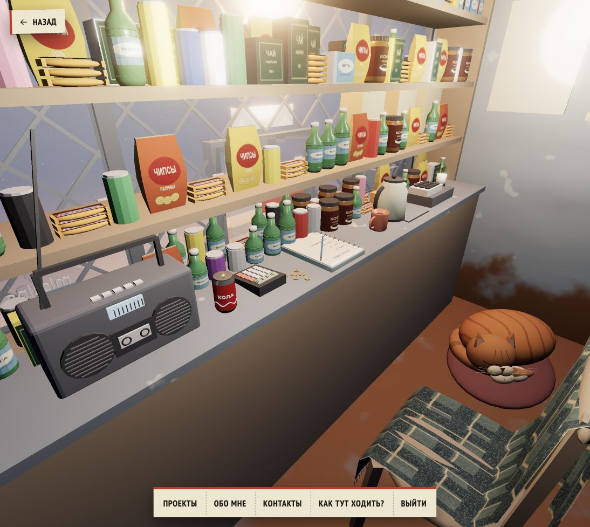
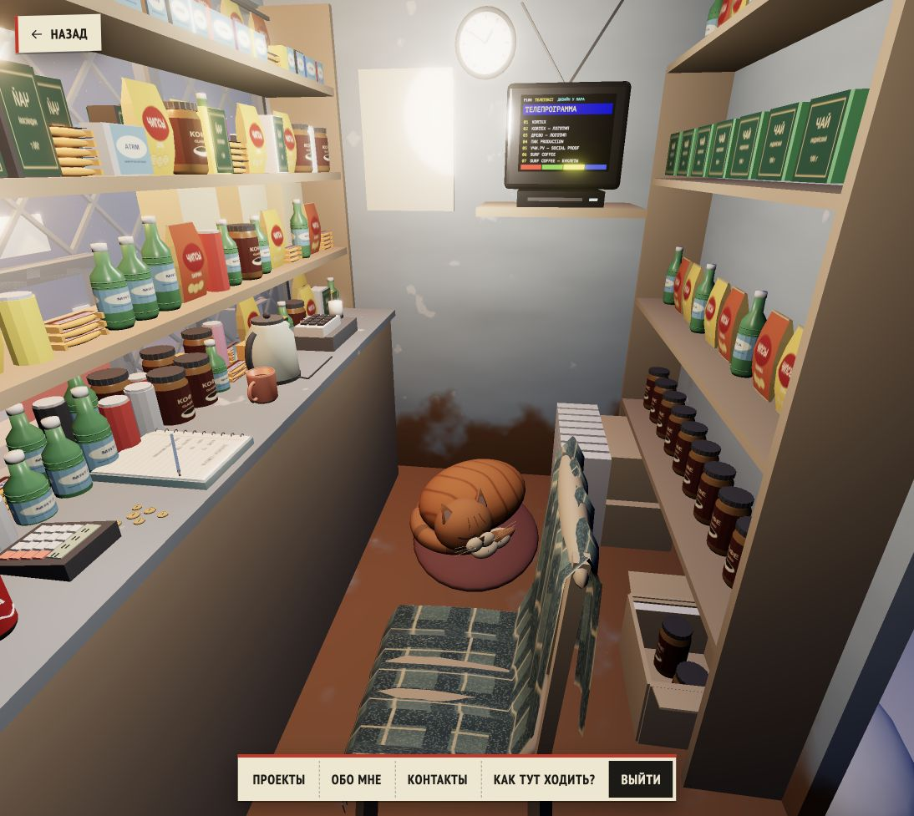

# Interior props pass — 2026-10-06

Continues Claude's clean HEAD 4ca8a25. Shapes and texture details only; preserves the existing TV/price/flyer/walking route implementation.

- Puffy snack bags with crimped ends, PET shoulders/caps/ribs, coffee jars with ribbed lids, printed tea/gum cartons and foil snack bars. Snickers lettering comes from the official product image; other packaging artwork is original.
- Rounded wooden chair with rails/spindles and a continuous folded plaid blanket, woven texture and fringe.
- Kettle with handle/spout/lid/cord, hollow mug with tea, calculator with keys/LCD, notebook pages/rings/pen, cash register/receipt and coins.
- Clock markers/hands, printed wall calendar, rounded radio/TV housings, radio cassette window/speaker grills/buttons and an open stock carton.
- Kept the cat, cola cans, hotspots, camera presets and navigation contracts. Existing stacked cartons were lowered to clear the first shelf.

Verification:
- Blender export successful; GLB 6,619,020 bytes (6.31 MiB), 275 primitives, within existing desktop limits of 8 MiB / 400 primitives. Asset grew from 3,773,900 bytes; this is not a performance improvement over baseline.
- `npm test`: 112 JavaScript tests + 9 Python tests passed.
- `npm run validate:content`: 7 projects, 2 pages passed.
- `npm run build`: passed; existing bundle-size advisory remains.
- Live browser: interior blanket/stock/counter visibly inspected; final counter screenshot below. No console warnings/errors in the live tab.
- Playwright at 390 × 844, reduced motion: entry, fixed eye during drag, exported props present and return home passed.
- Independent review found coins buried in the counter. Fixed by basing new props at the actual 1.03 m surface, added export bounds test, observed red before rebuild and green after. Final coin minimum Y 1.029999971 (float tolerance).
- Visual check caught mirrored tea/gum labels on the seller-facing side; UVs corrected, final screenshot verified.

Regeneration: `npm run build:kiosk`. If texture artwork changes, first run `scripts/build-props-textures.py` using a Python with Pillow (the bundled Codex Python was used here).
